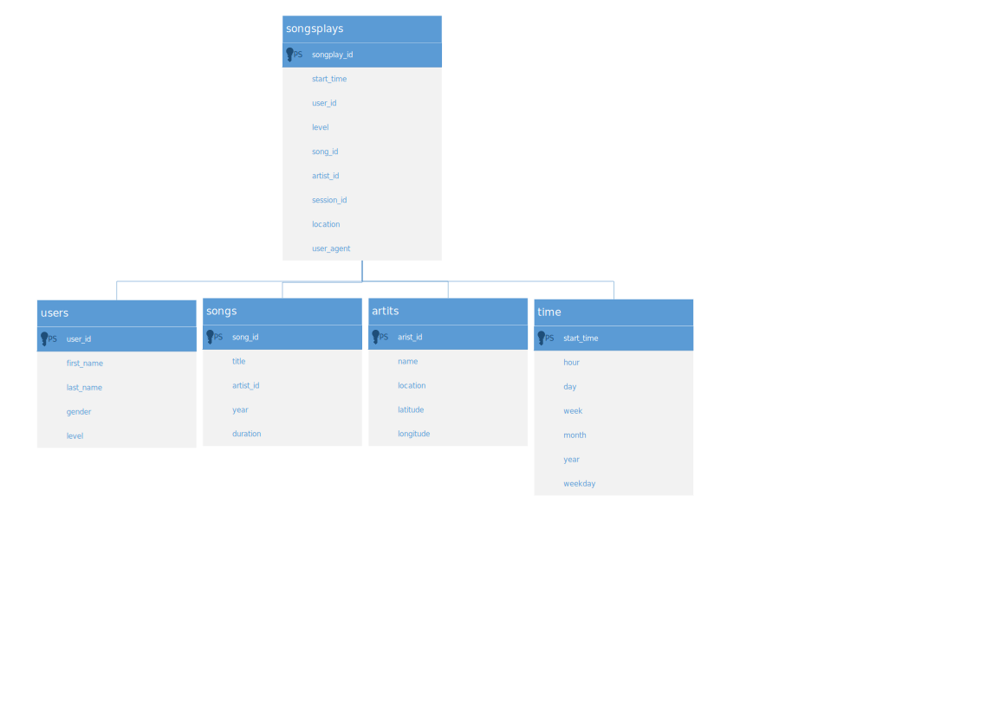
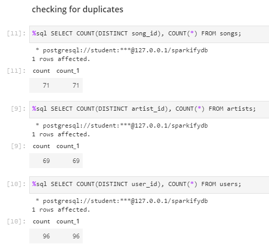

# sparkify_postgresql (Udacity Data Engineering Nano Degree - Project 1)
> copy on [github](https://github.com/dsmatthew/sparkify_postgresql)

Within this project the startup "Sparkify" would like to build a PostgreSQL database to analyze their logged user data. They collect data about songs played (streamed) by their users. This analysis should prepare to understand what their customers are listening to.

The raw data is provided within multiple json files differentiated by song data (songs, artists, albums etc.) and user action log data (users listening to music, navigating within the streaming application etc.).

### Table of Contents

1. [Installation](#installation)
2. [Project Motivation](#motivation)
3. [File Descriptions](#files)
4. [Results](#results)
5. [Licensing, Authors, and Acknowledgements](#licensing)

## Installation 

You need to have a Python 3.x environment and a PostgreSQL database. I used the built-in workspace solution provided by Udacity. You might need to install the "psycopg2" library first.

Used libraries:
* psycopg2
* pandas
* numpy
* sql_queries
* os, glob

HINT FOR USAGE:
1. Run _create_tables.py_ to create the database including the tables.
2. Run _etl.py_ (or the corresponding notebook) to import the json files into the database.
3. (optional) Run _test.ipynb_ to check the results.

## Project Motivation
Within this project I will create a PostgreSQL database including the ETL pipeline in Python as preparation for further analytics. As described above, there are two types of files: song data and user-action-log data.
All data sets are provided within the online course by Udacity (www.udacity.com).

## File Descriptions 
* data
 * data/log_data - contains user action data within multiple json files.
 * data/song_data - contains song data within multiple json files.
* create_tables.py - provides functions to interact with the database (create, drop tables...).
* sql_queries.py - contains the sql query statements.
* etl.ipynb / etl.py - contains the ETL process to load json files into the previously created tables.
* test.ipynb - allows to run predefined queries in order to check the table definition and content.

## Results

** Database schema**
As a result the following database schema is created:

* **Fact Tables**
 * **songplays** - records in log data associated with song plays i.e. records with page _NextSong_.
   
songplay_id, start_time, user_id, level, song_id, artist_id, session_id, location, user_agent

   

* **Dimension Tables**
 * **users** - users in the app
   
user_id, first_name, last_name, gender, level

 * **songs** - songs in music database
   
song_id, title, artist_id, year, duration

 * **artists** - artists in music database
   
artist_id, name, location, latitude, longitude

 * **time** - timestamps of records in **songplays**
   
start_time, hour, day, week, month, year, weekday

**ETL process**
The _etl.py_ script is used to extract the content from the json files - in detail the process works as followed:
1. Scan and retrieve all song and user action log data form the json files located in /data*
2. Each file will be imported as Pandas DataFrame and inserted via the defined SQL insert statements (sql_queries.py) into the database.
 * The song data will be inserted without any further data manipulation.
 * The user action log data will be preprocessed (only Actions wich are called _NextSong_ will be loaded, data type conversion on timestamp is applied including deriving time measures like week, dayofweek, month, year are added into the time table). The required user and artist ids are retrieved from the both corresponding tables by executing the select query from _sql_queries.py_. A collection of features / columns are inserted into the users and songplays table.

Handling of duplicated data: Occurring duplicates (in users, artists, time etc.) are handled within the sql queries (in sql_queries.py). By defining PRIMARY KEYS and NOT NULL contrains some conflict handling constraints are applied during the insert statement. This will handle potential duplicated entries (an example is the user_id of users or the artist_id of table artists).
As checked there are no duplicates:

## Licensing, Authors, Acknowledgements
I used data provided within the Nano Degree of Udacity. Including some descriptions belong to their documentations. All the licensing for the data and other information can be found on [Udacity](https://udacity.com)
